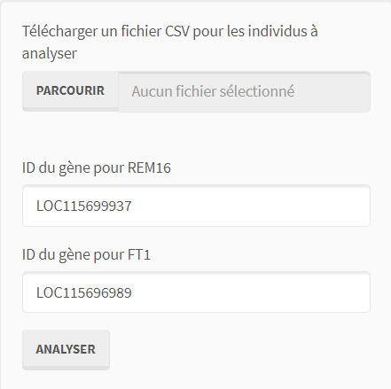
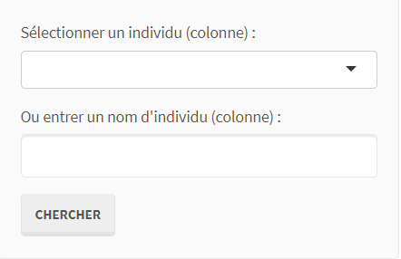
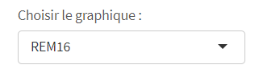
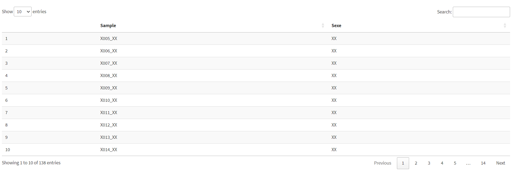

# BVG-7003-Devoir-1--SexCannalyzer_App-Shiny

# SexCannalyzer

SexCannalyzer est un outil interactif développé en R pour analyser les niveaux d'expression génique et prédire le sexe des plants de cannabis à partir des données RNASeq de deux gènes spécifiques : `REM16` et `FT1`. L'application permet aux utilisateurs de télécharger leurs propres données et d'obtenir des graphiques visuels ainsi que des prédictions de sexe basées sur un modèle SVM pré-entraîné.

## Cas d'utilisation
Ce script vise à :
1. Analyser les niveaux d'expression des gènes `REM16` et `FT1` dans des échantillons de cannabis.
2. Comparer ces niveaux d'expression avec des données de référence.
3. Prédire le sexe des plantes à partir des niveaux d'expression génique en utilisant un modèle de Support Vector Machine (SVM) pré-entraîné.

## Données d'entrée
L'application requiert les éléments suivants pour fonctionner correctement :
- **Fichier CSV d'expression génique** : Fichier contenant les niveaux d'expression des gènes pour différents échantillons. **METTRE LE RESTE DE LA DÉFINITION DE L'AUTRE README**
- ex_tab_csv.png
- **Identifiants de gènes** : Par défaut `LOC115699937` pour `REM16` et `LOC115696989` pour `FT1`. Ils peuvent être personnalisés via l'interface.
  
**Remarque** : Les identifiants de gènes sont utilisés pour renommer et standardiser les noms des gènes dans les graphiques et les prédictions.

## Résultats
1. **Graphiques d'expression génique** : Boxplots interactifs pour les gènes `REM16` et `FT1`, permettant de visualiser les niveaux d'expression des échantillons comparés aux données de référence.
   a. L'expression du gène REM16 du génotype sélectionné (en noir) comparé aux boxplotx des données de référence.
   
   b. L'expression du gène FT1 du génotype sélectionné (en noir) comparé aux boxplotx des données de référence.
   ft1.png
   c. L'expression des gènes REM16 et FT1 du génotype sélectionné (en noir) comparé aux boxplotx des données de référence coloré en fonction du gène.
   rem16+ft1.png
3. **Tableau de prédictions** : Résultats de la classification SVM, indiquant le sexe prédit pour chaque échantillon basé sur les niveaux d'expression des gènes.

## Instructions d'utilisation
1. **Télécharger les dépendances** : Installez les bibliothèques R requises (`dplyr`, `tidyr`, `ggplot2`, `ggpubr`, `shiny`, `shinythemes`, `e1071`, `DT`).
2. **Lancer l'application** :
   - Exécutez le script dans un environnement R avec le package Shiny.
3. **Télécharger vos données et lancer l'analyse** :
   - Utilisez le champ de téléversement pour charger un fichier CSV contenant les niveaux d'expression pour `REM16` et `FT1`.
   - Spécifiez les identifiants de gènes si différents des valeurs par défaut.
   - Cliquez sur "Analyser" pour afficher les boxplots et comparer vos échantillons avec les données de référence.
       

4. **Observation des données**
   - Sélectionnez le génotype à étudier (la première colonne par défaut). Vous pouvez sélectionner à partir de la liste déroulante ou simplement faire la recherche en entrant le nom de la colonne(génotype) suivit de la sélection du bouton chercher. La fonction recherche va dominer et actualiser la sélection par la liste. Si le nom sélectionné n'est pas dans la liste des noms des colonnes, un message d'erreur apparaîtra et annulera la recherche.
   - Sélectionnez un graphique spécifique (REM1, FT1, ou les deux) pour une visualisation personnalisée.
       
       

6. **Interpréter les résultats** :
   - Consultez les prédictions de sexe dans l'onglet "Tableau des résultats". Les échantillons sont identifiés par leur sexe basé sur les niveaux d'expression de `REM16` et `FT1`.
       
## Notes supplémentaires
- La taille des fichiers téléversés est limitée à 50 Mo.
